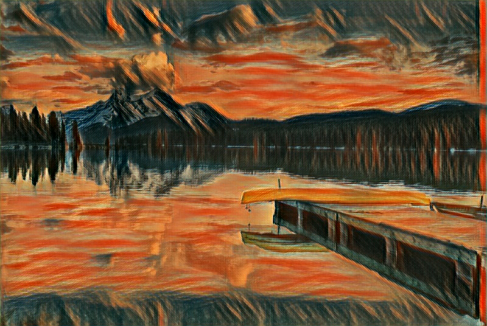

# Real-time-Neural-Style.

Neural style from some pre-trained models using opencv.


The following image have been generated using the following command:

```bash
python neural_style_transfer.py --image images/lake.jpg --model models/instance_norm/the_scream.t7 --path images/sample.jpg
```




The video version captures frame from your camera feed, to run this just passing the model path suffices.
```bash
    python neural_style_transfer_video.py --models models
```
press 'n' ti change the model used and 'q' to quit.

**Note** The models are ~200mb in size and aren't included in this repository.

A script to download the required models is included in models/
to download run,
```bash
    bash models/download_style_transfer_models.sh   
```


>Directory Structure
```bash
.
├── images
│   ├── outputs
│   ├── Chair.jpg
│   ├── ball.jpeg
│   ├── balloons.jpg
│   ├── lake.jpg
│   └── sample.jpg
├── models
│   ├── eccv16
│   │   ├── composition_vii.t7
│   │   ├── la_muse.t7
│   │   ├── starry_night.t7
│   │   └── the_wave.t7
│   ├── instance_norm
│   │   ├── candy.t7
│   │   ├── feathers.t7
│   │   ├── la_muse.t7
│   │   ├── mosaic.t7
│   │   ├── the_scream.t7
│   │   └── udnie.t7
│   └── download_style_transfer_models.sh
├── infer.py
├── neural_style_transfer.py
├── neural_style_transfer_video.py
└── requirements.txt

5 directories, 20 files
```